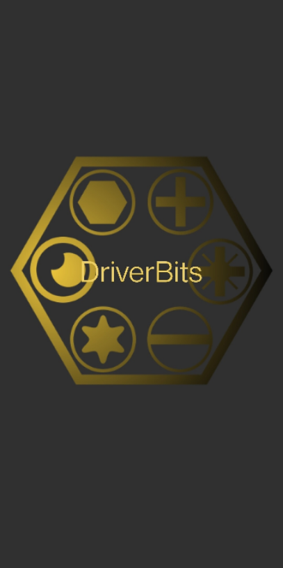

# DriverBits

ScrewDriver system end user app built with Flutter

## Splash screen

[flutter_native_splash](https://pub.dev/packages/flutter_native_splash) made possible to create splash screen for the application.

## Loading screen

Flutter widget utilising [shimmer](https://pub.dev/packages/shimmer)

